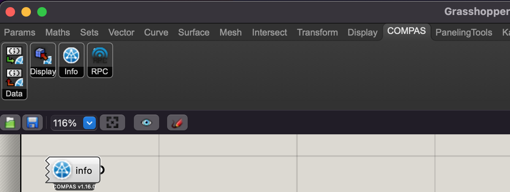

# Workshop AAD22
at Department of Architecture, National Cheng Kung University (NCKU), Taiwan


## Workshop Team
* ChiaChing Yen


## Schedule
### Session I: Introduction to Python / COMPAS
Thursday, 24th, Nov, 2022
09:00 - 11:00 AM GMT+8


### Session II: Introduction to Robotics / ROS
Thursday, 1st, Dec, 2022
09:00 - 12:00 AM GMT+8


# Files
We will share the main tools and files via this repository.
## Slides
### Day 1
* [Slides](https://docs.google.com/presentation/d/1DhorE3vvWhWAOLSAfeg5oq3S4Y3-MM3D3Wjon9DCh2M/edit?usp=sharing)

### Day 2
* Slides
* [KUKA Operator Training Level 1](https://docs.google.com/presentation/d/15XVlAwplSnY7Gh0MX_H0Y_2SLvio-tZHKGouif-THcs/edit#slide=id.g104a09d43b2_0_116)


## Computer Setup
### Program List
* Windows 10 Pro or Mac OS Sierra 10.12
* [miniconda 3](https://docs.conda.io/en/latest/miniconda.html)
* [Docker Desktop](https://www.docker.com/products/docker-desktop) 
* [Rhino 6 or 7](https://www.rhino3d.com/download)
* [Visual Studio Code](https://code.visualstudio.com/)


### Python and Installation

We use `conda` to make sure we have clean, isolated environment for Python and dependencies.

First, open `Anaconda Powershell Prompt (miniconda3)` (Windows) or `Terminal` (macOS).

Then, execute the following commands:
```
conda config --add channels conda-forge
conda create -n AAD22 compas compas_fab compas_view2
conda activate AAD22
```
Before the last step, make sure the scripting interface of Rhino has been initialized at least once. This only needs to be done once on every computer. To do that, open Rhino and navigate to `Tools > PythonScript > Edit...`. Once the script editor shows up, the interface is successfully initialized, and Rhino could be closed.

Finally, depending on your installed Rhino version, execute one of the flollowing:

#### Rhino 6
```
python -m compas_rhino.install -v 6.0
```

#### Rhino 7
```
python -m compas_rhino.install -v 7.0
```
### Visual Studio Setup

Open Visual Studio Code and install the following extensions:
* ms-python.python
* ms-azuretools.vscode-docker

## Verify Installation
### Docker
Please open `Docker Desktop`, then open `PowerShell`(Windows) or `Terminal`(macOS) and execute the command:

```
docker run hello-world
```

### Python and Rhino
Check if the tab COMPAS exists in Grasshopper. Place the `info` component on the canvas to get more information.


## note
A docker image file around 4GB needs to be deployed to the computer before the session.

The computer should have access to the internet(at least github.com) during the session.

